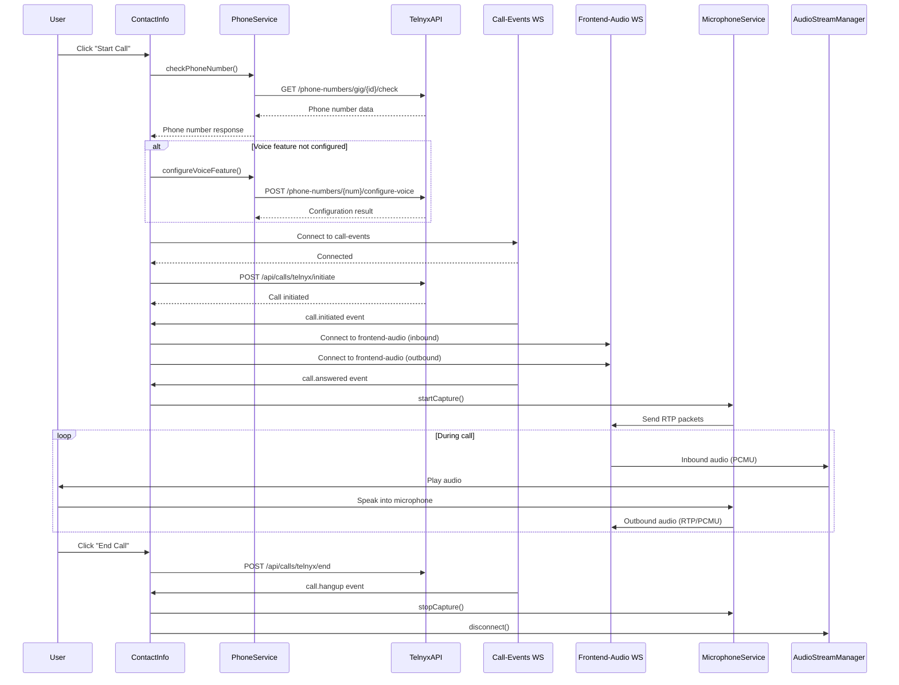

# Documentation du Processus d'Appel Telnyx

## Vue d'ensemble

Cette documentation décrit le processus complet d'initiation et de gestion des appels Telnyx dans l'application, incluant la vérification des numéros, la configuration des fonctionnalités vocales, l'établissement des connexions WebSocket et la gestion audio bidirectionnelle.

## Flux Global d'Initialisation d'un Appel

### Phase 1 : Vérification et Configuration Préalable
```
1. Vérification du numéro de gig actif
   ├── GET /phone-numbers/gig/{gigId}/check
   └── Si provider = 'telnyx' ET features.voice = false
       └── POST /phone-numbers/{phoneNumber}/configure-voice
```

### Phase 2 : Établissement des Connexions WebSocket
```
2. Connexion WebSocket Call-Events (Temps Réel)
   ├── URL: ws://{API_URL}/ws/call-events
   ├── Gestion des événements: call.initiated, call.answered, call.hangup
   └── État de connexion: isTelnyxConnected
```

### Phase 3 : Initiation de l'Appel
```
3. Appel à l'API Telnyx
   ├── POST /api/calls/telnyx/initiate
   ├── Payload: { to, from, agentId }
   └── Réponse: { success, data: { callId } }
```

### Phase 4 : Configuration Audio Bidirectionnelle
```
4. Configuration des WebSockets Audio (sur événement call.initiated)
   ├── WebSocket Inbound (Réception)
   │   ├── URL: ws://{API_URL}/frontend-audio
   │   ├── Service: AudioStreamManager
   │   ├── Format: PCMU (µ-law) base64
   │   └── Usage: Jouer l'audio entrant
   │
   └── WebSocket Outbound (Transmission)
       ├── URL: ws://{API_URL}/frontend-audio
       ├── Service: MicrophoneService
       ├── Format: RTP + PCMU (µ-law) base64
       └── Usage: Envoyer l'audio du microphone
```

### Phase 5 : Activation Audio (sur événement call.answered)
```
5. Démarrage de la Capture Micro
   ├── MicrophoneService.startCapture()
   ├── Worklet Audio Processor (downsampling 48kHz → 8kHz)
   ├── Encodage PCMU + Headers RTP
   └── Envoi via WebSocket Outbound
```

### Phase 6 : Gestion Continue
```
6. Pendant l'Appel
   ├── Réception audio: WebSocket Inbound → AudioStreamManager → Speakers
   ├── Transmission audio: Microphone → MicrophoneService → WebSocket Outbound
   ├── Transcription: WebSocket Transcription (optionnel)
   └── Enregistrement: Chunks WAV de 3 secondes (automatique)
```

### Phase 7 : Fin d'Appel
```
7. Terminaison
   ├── Événement call.hangup reçu
   ├── Nettoyage des WebSockets
   ├── Arrêt des services audio
   └── Sauvegarde de l'appel en base
```

### Architecture WebSocket

```
┌─────────────────┐    ┌──────────────────┐    ┌─────────────────┐
│   Frontend      │    │    Backend       │    │     Telnyx      │
│                 │    │                  │    │                 │
│ ┌─────────────┐ │    │ ┌──────────────┐ │    │                 │
│ │Call-Events  │◄┼────┼─┤/ws/call-events│ │    │                 │
│ │WebSocket    │ │    │ │              │ │    │                 │
│ └─────────────┘ │    │ └──────────────┘ │    │                 │
│                 │    │                  │    │                 │
│ ┌─────────────┐ │    │ ┌──────────────┐ │    │                 │
│ │Frontend-    │◄┼────┼─┤/frontend-    │◄┼────┤                 │
│ │Audio        │ │    │ │audio         │ │    │                 │
│ │(Inbound)    │ │    │ │              │ │    │                 │
│ └─────────────┘ │    │ └──────────────┘ │    │                 │
│                 │    │                  │    │                 │
│ ┌─────────────┐ │    │ ┌──────────────┐ │    │                 │
│ │Frontend-    │┼────┼─►│/frontend-    │┼────┼─►                 │
│ │Audio        │ │    │ │audio         │ │    │                 │
│ │(Outbound)   │ │    │ │              │ │    │                 │
│ └─────────────┘ │    │ └──────────────┘ │    │                 │
└─────────────────┘    └──────────────────┘    └─────────────────┘
```

**Légende :**
- **Call-Events WS** : Événements d'appel en temps réel (initiated, answered, hangup)
- **Frontend-Audio WS (Inbound)** : Réception audio du destinataire (PCMU base64)
- **Frontend-Audio WS (Outbound)** : Transmission audio du microphone (RTP+PCMU base64)

## Architecture Générale

Le processus d'appel Telnyx utilise plusieurs composants interconnectés :

1. **Vérification des numéros** (`useGigPhoneNumber`)
2. **Gestion des appels** (`useCallManager`)
3. **Connexions WebSocket** (call-events + frontend-audio)
4. **Services audio** (`MicrophoneService` + `AudioStreamManager`)
5. **Transcription** (`TranscriptionService`)

---

## 1. Phase de Vérification et Configuration

### 1.1 Vérification du Numéro de Gig

**Endpoint :** `GET /phone-numbers/gig/{gigId}/check`

**Processus :**
```typescript
// Dans ContactInfo.tsx - initiateCall()
const phoneNumberResponse = await checkPhoneNumber();

if (!phoneNumberResponse.hasNumber) {
  throw new Error('No active phone number found for this gig');
}

const { number } = phoneNumberResponse;
```

**Réponse attendue :**
```typescript
interface PhoneNumberResponse {
  hasNumber: boolean;
  message?: string;
  number?: {
    phoneNumber: string;
    provider: 'telnyx' | 'twilio';
    status: string;
    features: {
      voice: boolean;
      sms: boolean;
    };
  };
}
```

### 1.2 Configuration de la Fonctionnalité Voice

**Condition :** Si `number.provider === 'telnyx'` ET `number.features.voice === false`

**Endpoint :** `POST /phone-numbers/{phoneNumber}/configure-voice`

**Processus :**
```typescript
if (!number.features.voice) {
  console.log('🔧 Configuring voice feature for Telnyx number:', number);
  
  const success = await configureVoiceFeature(number);
  if (!success) {
    throw new Error('Failed to configure voice feature for Telnyx number');
  }
}
```

**Réponse attendue :**
```typescript
interface VoiceConfigResponse {
  success: boolean;
  message?: string;
  data?: {
    status: string;
  };
}
```

---

## 2. Initiation de l'Appel

### 2.1 Connexion WebSocket Call-Events

**URL :** `ws://{API_URL}/ws/call-events`

**Initialisation :**
```typescript
// Dans useCallManager.ts
const WS_URL = `${BACKEND_URL.replace('http', 'ws')}/ws/call-events`;
const websocket = new WebSocket(WS_URL);

websocket.onopen = () => {
  console.log('✅ Connected to call events WebSocket');
};
```

**Événements gérés :**
- `welcome` : Connexion établie
- `call.initiated` : Appel initié
- `call.answered` : Appel répondu
- `call.hangup` : Appel terminé

### 2.2 Initiation de l'Appel

**Endpoint :** `POST /api/calls/telnyx/initiate`

**Payload :**
```typescript
{
  to: string,        // Numéro du contact
  from: string,      // Numéro Telnyx du gig
  agentId: string    // ID de l'agent
}
```

**Processus :**
```typescript
const initiateTelnyxCall = async (phoneNumber: string) => {
  await initiateTelnyxCallRaw(
    contact.phone,           // To number (contact's number)
    phoneNumber,             // From number (our Telnyx number)
    getAgentIdFromStorage()  // Agent ID
  );
};
```

---

## 3. Gestion des Événements en Temps Réel

### 3.1 WebSocket Call-Events

**URL :** `ws://{API_URL}/ws/call-events`

**Gestion des événements :**
```typescript
websocket.onmessage = (event) => {
  const data: CallEvent = JSON.parse(event.data);
  
  switch (data.type) {
    case 'call.initiated':
      setCallStatus('call.initiated');
      setCurrentCallId(data.payload.call_control_id);
      // Configuration des URLs audio
      break;
    
    case 'call.answered':
      setCallStatus('call.answered');
      // Démarrage de la capture micro
      break;
    
    case 'call.hangup':
      setCallStatus('call.hangup');
      // Nettoyage des ressources
      break;
  }
};
```

### 3.2 Configuration des URLs Audio

**Déclencheur :** Événement `call.initiated`

**Processus :**
```typescript
case 'call.initiated':
  const baseWsUrl = import.meta.env.VITE_API_URL_CALL?.replace('http://', 'ws://').replace('https://', 'wss://');
  const inboundWsUrl = `${baseWsUrl}/frontend-audio`;
  const outboundWsUrl = `${baseWsUrl}/frontend-audio`;
  
  setStreamUrl(inboundWsUrl);      // Pour la réception audio
  setOutboundStreamUrl(outboundWsUrl); // Pour l'envoi audio
  break;
```

---

## 4. Gestion Audio Bidirectionnelle

### 4.1 Réception Audio (Inbound)

**Service :** `AudioStreamManager`
**URL :** `ws://{API_URL}/frontend-audio`

**Processus :**
```typescript
// Connexion WebSocket
const audioManager = new AudioStreamManager();
await audioManager.connect(streamUrl);

// Gestion des messages
ws.onmessage = async (event) => {
  if (typeof event.data === 'string') {
    const message = JSON.parse(event.data);
    if (message.event === 'media' && message.media.payload) {
      const base64 = message.media.payload;
      const u8 = this.base64ToUint8Array(base64);
      const float32 = this.convertFromPCMU(u8);
      this.enqueueChunk(float32);
    }
  }
};
```

**Caractéristiques :**
- **Format :** PCMU (µ-law) encodé en base64
- **Sample Rate :** 8kHz
- **Jitter Buffer :** 3 chunks minimum avant lecture
- **Queue Max :** 60 chunks (drop oldest si dépassement)

### 4.2 Transmission Audio (Outbound)

**Service :** `MicrophoneService`
**URL :** `ws://{API_URL}/frontend-audio`

**Processus :**
```typescript
// Connexion WebSocket
const outboundWs = new WebSocket(outboundStreamUrl);
const mic = new MicrophoneService(outboundWs);

// Capture micro
await mic.startCapture();
```

**Chaîne audio :**
```typescript
// 1. Capture microphone
this.stream = await navigator.mediaDevices.getUserMedia({ 
  audio: {
    echoCancellation: true,
    noiseSuppression: true,
    autoGainControl: true,
    sampleRate: 48000
  } 
});

// 2. Création AudioContext
this.audioContext = new AudioContext();
const source = this.audioContext.createMediaStreamSource(this.stream);

// 3. Worklet pour encodage RTP/PCMU
await this.audioContext.audioWorklet.addModule(workletUrl);
this.node = new AudioWorkletNode(this.audioContext, 'mic-processor');

// 4. Connexion et envoi
source.connect(this.node);
this.node.port.onmessage = (ev) => {
  const rtpPacket: Uint8Array = ev.data;
  const base64 = this.uint8ToBase64(rtpPacket);
  this.outboundWs.send(JSON.stringify({ 
    event: 'media', 
    media: { payload: base64 } 
  }));
};
```

**Caractéristiques :**
- **Format :** RTP + PCMU (µ-law)
- **Sample Rate :** 8kHz (downsampling depuis 48kHz)
- **Buffer Size :** 4096 samples
- **Enregistrement :** Chunks de 3 secondes en WAV

---

## 5. Worklet Audio Processor

**Fichier :** `src/worklets/mic-processor.worklet.js`

**Fonctionnalités :**
- Downsampling 48kHz → 8kHz
- Encodage PCMU (µ-law)
- Génération des headers RTP
- Envoi des paquets via MessagePort

**Calcul du ratio de downsampling :**
```javascript
// Dans le constructeur du worklet
this.ratio = sampleRate / 8000; // Ex: 48000 / 8000 = 6
```

---

## 6. Gestion de la Transcription

**Service :** `TranscriptionService`
**URL :** `ws://{API_URL}/ws/transcription`

**Processus :**
```typescript
// Initialisation lors de l'acceptation d'appel
await startTranscription(stream, contact.phone);

// Configuration
const config = {
  sampleRate: this.audioContext.sampleRate,
  channels: 1,
  format: 'pcm16'
};

this.ws.send(JSON.stringify({
  type: 'config',
  payload: config
}));
```

---

## 7. Nettoyage et Fin d'Appel

### 7.1 Fin d'Appel par l'Agent

**Processus :**
```typescript
const endCall = async () => {
  // 1. Arrêter la capture micro
  if (microphoneService) {
    microphoneService.stopCapture();
  }
  
  // 2. Terminer l'appel Telnyx
  await endTelnyxCall();
  
  // 3. Nettoyage des états
  setCallStatus('idle');
  setStreamUrl(null);
  dispatch({ type: 'END_CALL' });
};
```

### 7.2 Nettoyage Automatique

**Déclencheur :** Événement `call.hangup`

**Processus :**
```typescript
case 'call.hangup':
  setCallStatus('idle');
  setStreamUrl(null);
  setOutboundStreamUrl(null);
  dispatch({ type: 'END_CALL' });
  break;
```

---

## 8. Gestion des Erreurs

### 8.1 Erreurs de Connexion WebSocket

```typescript
ws.onerror = (error) => {
  console.error('❌ WebSocket error:', error);
  setError('WebSocket connection error');
};

ws.onclose = () => {
  console.log('🔌 WebSocket connection closed');
  // Tentative de reconnexion automatique
  setTimeout(() => this.initializeWebSocket(), 3000);
};
```

### 8.2 Erreurs Audio

```typescript
// Test des permissions microphone
const permissionTest = await MicrophoneService.testMicrophonePermissions();
if (!permissionTest.success) {
  setPhoneNumberError(`Microphone error: ${permissionTest.error}`);
  return;
}
```

---

## 9. Variables d'Environnement Requises

```env
VITE_API_URL_CALL=http://localhost:3000
VITE_COMP_ORCH_API=http://localhost:3001
```

---

## 10. Flux Complet d'un Appel



---

## 11. Points de Debug Importants

### 11.1 Logs de Connexion
```javascript
// Vérifier la connexion WebSocket
console.log('✅ Connected to call events WebSocket');
console.log('🎤 WebSocket connected for audio streaming');
```

### 11.2 Logs Audio
```javascript
// Vérifier l'envoi audio
console.log(`📦 RTP packet #${chunkCount}: ${rtpPacket.length} bytes`);
console.log(`✅ Sent RTP packet #${chunkCount} via outbound WebSocket`);

// Vérifier la réception audio
console.log('🎧 AudioContext initialisé (sampleRate:', this.SAMPLE_RATE, ')');
```

### 11.3 Logs d'État
```javascript
// Vérifier les changements d'état
console.log('📞 Telnyx call status:', telnyxCallStatus);
console.log('📞 Call answered');
console.log('🎤 Capture micro démarrée');
```

---

## 12. Tests et Validation

### 12.1 Test des Permissions Microphone
```typescript
const testMicrophonePermissions = async () => {
  const result = await MicrophoneService.testMicrophonePermissions();
  if (result.success) {
    console.log('✅ Microphone permissions OK');
  } else {
    console.error('❌ Microphone permissions failed:', result.error);
  }
};
```

### 12.2 Test de Connexion WebSocket
- Vérifier les logs de connexion dans la console
- S'assurer que les URLs WebSocket sont correctes
- Tester la reconnexion automatique

### 12.3 Test Audio
- Vérifier l'enregistrement des fichiers WAV (3 secondes)
- Tester la qualité audio bidirectionnelle
- Valider l'encodage PCMU et RTP

---

Cette documentation couvre l'ensemble du processus d'appel Telnyx implémenté dans votre application, depuis la vérification des numéros jusqu'à la gestion audio bidirectionnelle en temps réel.
